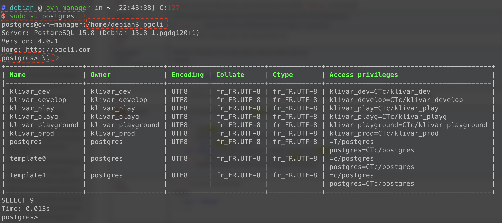

# Bareau Databases and users

This Terraform project contains the databases and users used by bareau.

## Pre-requisites

1. Since the Database is not remotely accessible, we need to set up a port forwarding with SSH to access it. So you need
   SSH access to server. This command creates the port
   forwarding: `ssh -L 5432:localhost:5432 -p 2522 ubuntu@db-admin.gbm-soft.tech -N`. After running this, the remote DB is
   accessible via `localhost:5432`.
2. Export an environment variable for the `postgres` superuser. `export PGPASSWORD='xxxxxxx'`
3. Go into this folder and run `terraform init` to init the project.
4. Run `terraform plan` to make sure you can connect to the database

## How to add a new database and its user

Call the module like this with the name of the database you want

- In [main.tf](main.tf) file
   ```terraform
   module "bareau_new" {
     source        = "./bareau-database-and-user"
     instance_name = "new"
   }
   ```
- In [outputs.tf](outputs.tf)
  ```terraform
  output "bareau_new" {
    value     = module.bareau_new
    sensitive = true
  }
  ```
- Run `terraform apply` to check the plan. You should see some new resources being added.
- To get the actual DB name, user and password, run `terraform output bareau_new`

## How to connect to the database via the CLI

Once logged in via SSH to the server, do the following:

```shell
sudo su postgres
pgcli
```

Example: 



